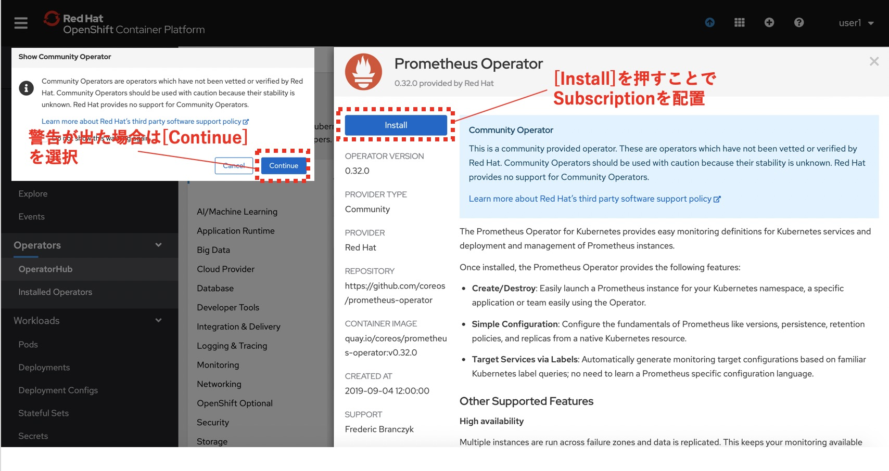
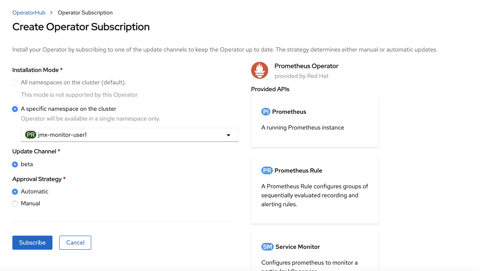
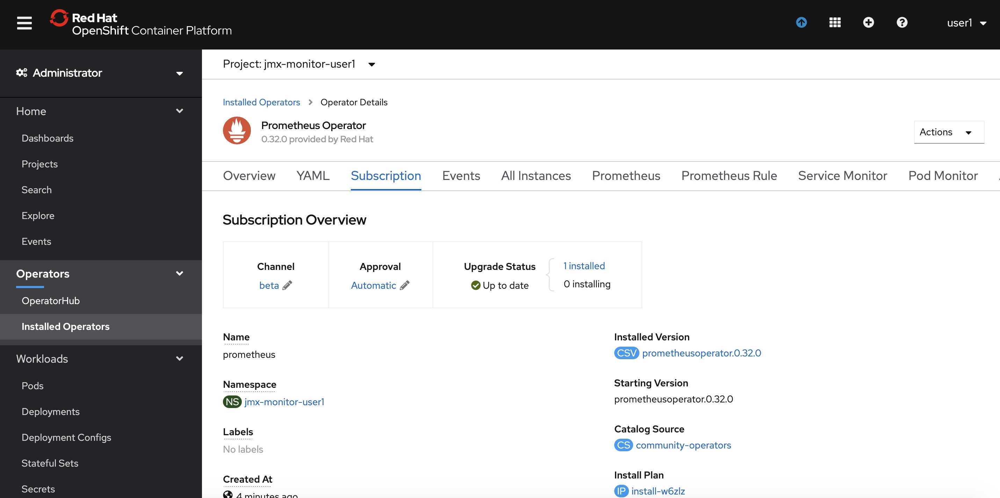

## 2. Prometheus Operatorの展開
ユーザデータ向けPrometheusをOpenShiftへデプロイする

### 2-1. プロジェクト作成  
Prometheus Operator用のプロジェクトを作成する。

```
$ oc new-project jmx-monitor-<User_ID>
$ oc project
Using project "jmx-monitor-<User_ID>" on server "https://<OpenShift API>".
```

### 2-2. Subscriptionを作成  
ブラウザからOpenShift Portalにログインし、[Operators]>[OperatorHub]からPrometheusを検索する。   
この際、プロジェクトが「jmx-monitor-<User_ID>」であることを確認しておく。   
          


OperatorHubの中から、Prometheus Operator(Community)を選択して、[Install]を行う。        
※コミュニティ版を利用すると、警告が表示されるので、一旦[Continue]で続ける。(OCP 4.4現在)    
     


Subscriptionは、以下の設定で作成する。  
* Installation Mode  
A specific namespace on the cluster: [PR] jmx-monitor-<User_ID>  
* Update Channel  
beta  
* Approval Strategy  
Automatic   
  
|InstallMode|Action|
|:--|:--|
|OwnNamespace|Operatorは、独自のnamespace を選択するOperatorGroupのメンバーにできます。|
|SingleNamespace|Operatorは1つのnamespace を選択するOperatorGroupのメンバーにできます。|
|MultiNamespace|Operatorは複数の namespace を選択するOperatorGroupのメンバーにできます。|
|AllNamespaces|Operatorはすべての namespace を選択するOperatorGroupのメンバーできます (ターゲット namespace 設定は空の文字列 "" です)。|

実際にGUI上では以下のように設定し、[Subscribe]を選択します。
   


正しくSubscriptionが設定されると、[Status]がSucceededになりOperatorが展開されます。また、以下のように[Operators]>[Installed Operators]>[Prometheus Operator]>[Subscription]から、Subscriptionの概要が確認できます。



これで、Prometheus OperatorのSubscriptionが作成されました。なおこの時点では、CRDの登録やPrometheus Operatorの配置が行われるだけで、Prometheusのプロセス自体は構築されません。

### 2-3. CRD/Operatorの確認    

Prometheus OperatorのSubscriptionを作成すると、CRD(Custom Resource Definition)が作成される。

```
$ oc get crd -n jmx-monitor-<User_ID> |grep monitoring.coreos.com
alertmanagers.monitoring.coreos.com                         2020-04-27T01:14:40Z
podmonitors.monitoring.coreos.com                           2020-04-27T01:14:41Z
prometheuses.monitoring.coreos.com                          2020-04-27T01:14:40Z
prometheusrules.monitoring.coreos.com                       2020-04-27T01:14:41Z
servicemonitors.monitoring.coreos.com                       2020-04-27T01:14:40Z
```


Promethus Operatorは、標準で4つ（最新バージョンでは5つ）のCRDを保持している。  
GUIからは[Operators]>[Installed Operators]>[Prometheus Operator] を確認。オペレーターカタログとして、デプロイされたPromethus OperatorのCRDが確認できる。


また、Prometheus OperatorがOLMによって配置される。

```
$ oc get po -n jmx-monitor-<User_ID>
NAME                                   READY   STATUS    RESTARTS   AGE
prometheus-operator-7cf7d5f74b-r4qmd   1/1     Running   0          16m
```
[トップへ戻る](README.md)