## 3. ZabbixをOpenShiftへデプロイする
以下の2つの手順から選択する
- 3.1. コンテナイメージを使ったデプロイ
- 3.2. Zabbix Operatorを使ったデプロイ 

### 3.1. Deploying zabbix on OpenShift using appliance container image
```sh
$ oc new-project zabbix
$ oc adm policy add-scc-to-user anyuid -z default
$ oc new-app registry.connect.redhat.com/zabbix/zabbix-appliance-44
--> Found Docker image 3b1c1c9 (5 days old) from registry.connect.redhat.com for "registry.connect.redhat.com/zabbix/zabbix-appliance-44"

    Zabbix Appliance 
    ---------------- 
    Zabbix appliance with MySQL database support and Nginx web-server

    Tags: zabbix, zabbix-appliance, mysql, nginx

    * An image stream tag will be created as "zabbix-appliance-44:latest" that will track this image
    * This image will be deployed in deployment config "zabbix-appliance-44"
    * Ports 10051/tcp, 443/tcp, 80/tcp will be load balanced by service "zabbix-appliance-44"
      * Other containers can access this service through the hostname "zabbix-appliance-44"
    * This image declares volumes and will default to use non-persistent, host-local storage.
      You can add persistent volumes later by running 'oc set volume dc/zabbix-appliance-44 --add ...'

--> Creating resources ...
    imagestream.image.openshift.io "zabbix-appliance-44" created
    deploymentconfig.apps.openshift.io "zabbix-appliance-44" created
    service "zabbix-appliance-44" created
--> Success
    Application is not exposed. You can expose services to the outside world by executing one or more of the commands below:
     'oc expose svc/zabbix-appliance-44' 
    Run 'oc status' to view your app.
$ oc expose svc/zabbix-appliance-44
route.route.openshift.io/zabbix-appliance-44 exposed
```

### 3.2. Deploying zabbix on OpenShift using Zabbix Operator

1. Create following file as zab_secret.yml and create secret using `oc create`


```sh
$ oc new-project zabbix
```

```yaml:zab_secret.yml
kind: Secret
apiVersion: v1
metadata:
  name: zabbix-full-secrets
data:
  mysql_root_password: emFiYml4X3N1cGVyX3Jvb3Q=
  mysql_zabbix_password: emFiYml4X3VzZXJfcGFzc3dvcmQ=
  mysql_zabbix_username: emFiYml4
type: Opaque
```
```
$ oc create -f zab_secret.yml -n zabbix
secret/zabbix-full-secrets created
```

2. Create following file as zab_pvc.yml and create PVC using `oc create`
```yaml:zab_pvc.yml
kind: PersistentVolumeClaim
apiVersion: v1
metadata:
  name: mysql-volume-claim
spec:
  accessModes:
    - ReadWriteOnce
  resources:
    requests:
      storage: 20Gi
  storageClassName: gp2
  volumeMode: Filesystem
```
```
$ oc create -f zab_pvc.yml -n zabbix
persistentvolumeclaim/mysql-volume-claim created
```

3. Install Zabbix Operator
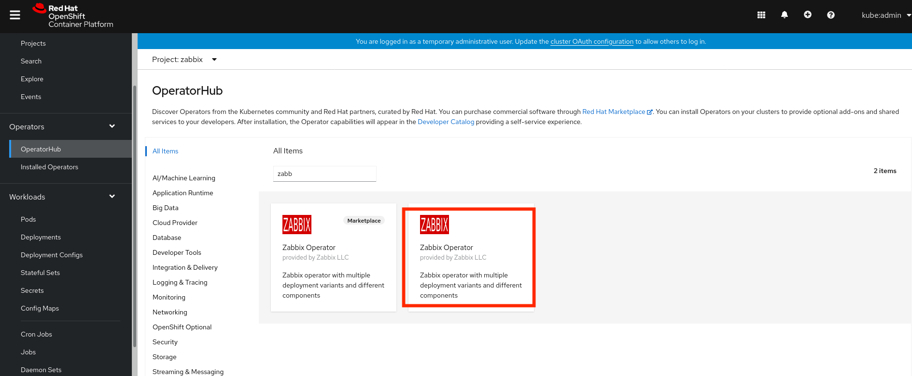
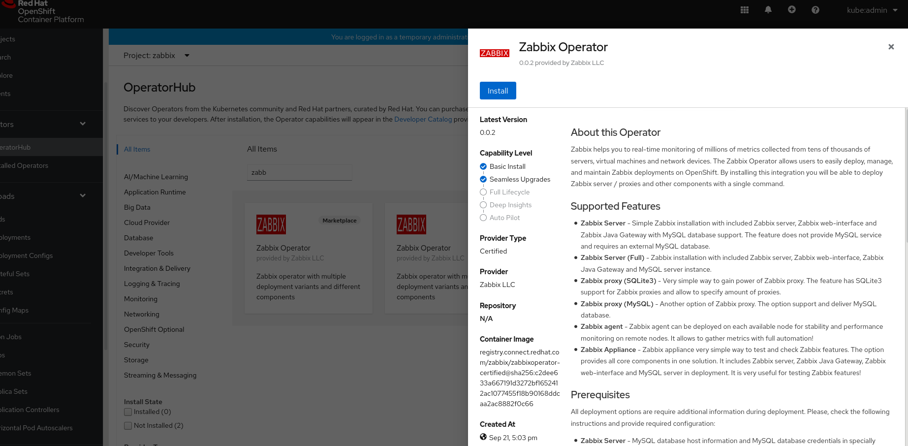
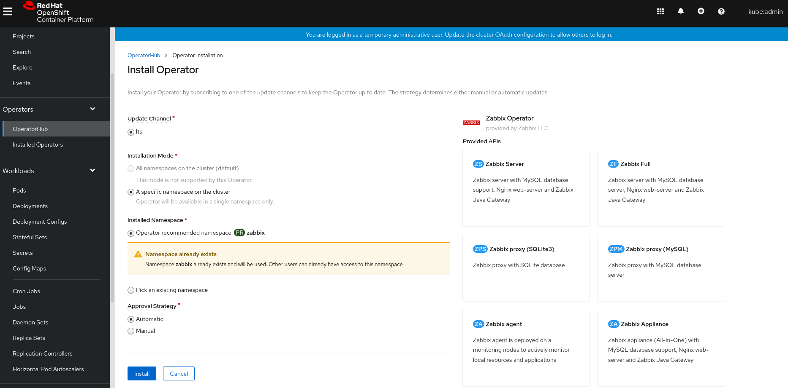
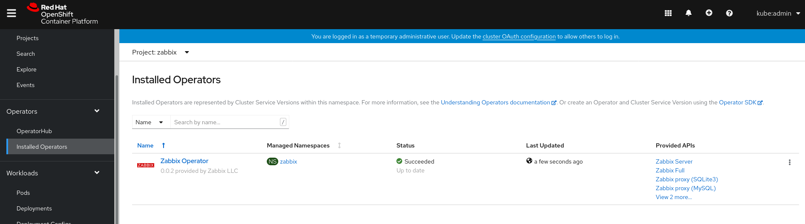

4. Create CRD(Zabbix Full)
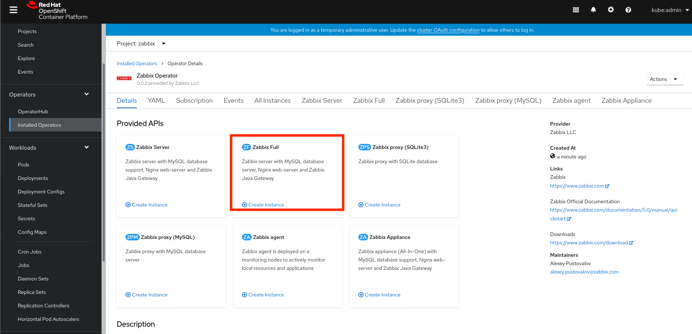
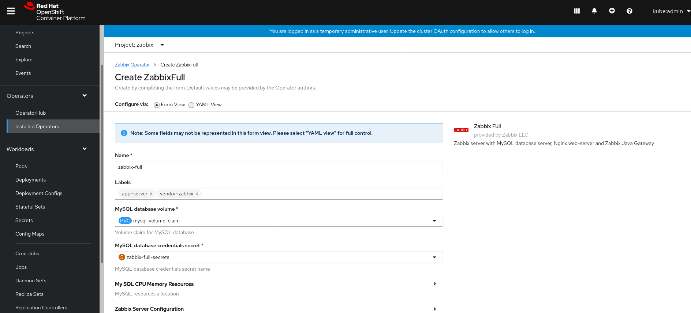
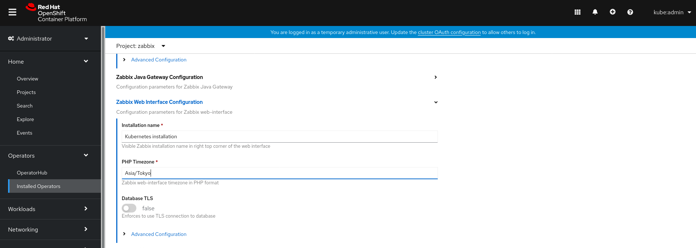
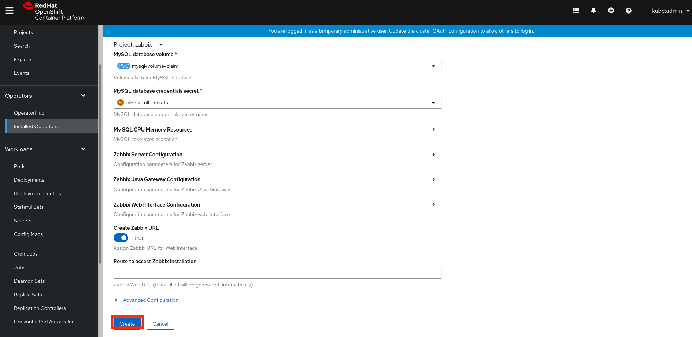
- MySQL database volume: `mysql-volume-claim`
- MySQL databse credentials secret: `zabbix-full-secrets`  
if you need, 
- PHP Timezone: `Asia/Tokyo`

5. Check running pods
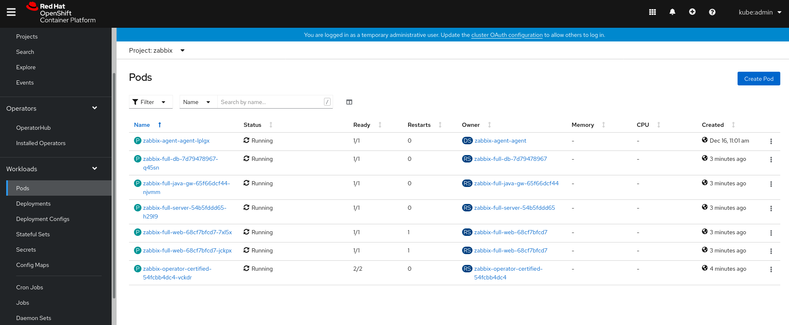

6. Check route URL
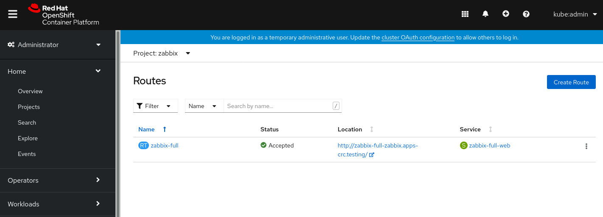

7. Access Zabbix Console using router URL
- Default User: Admin
- Default Password: zabbix
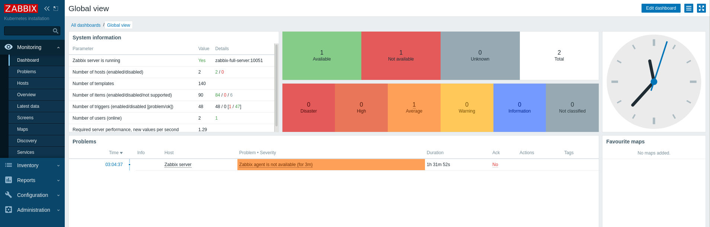


[トップへ戻る](README.md)