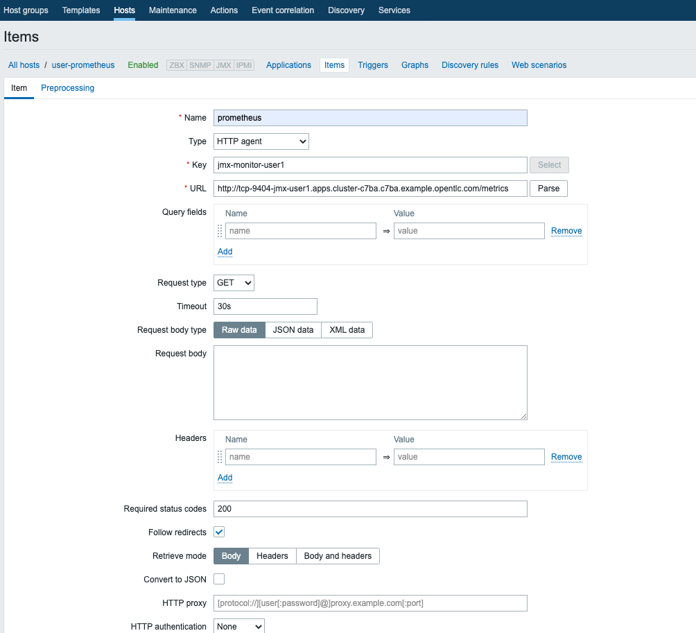
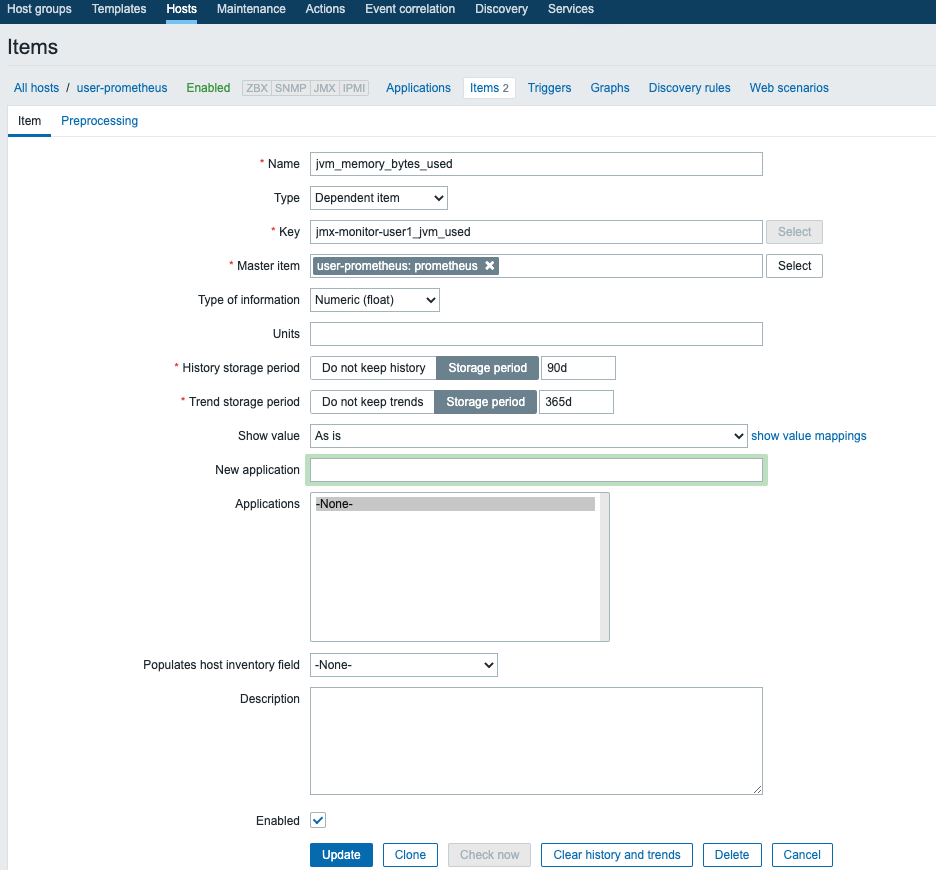
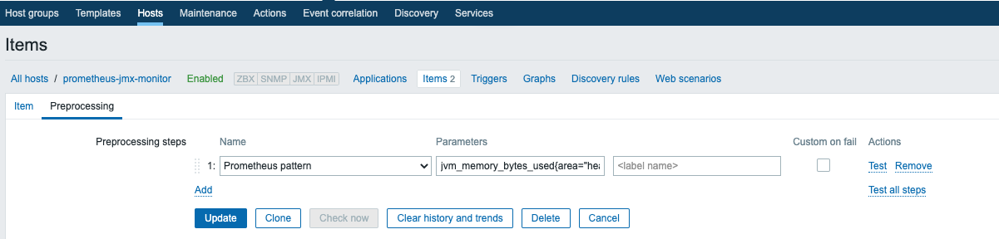
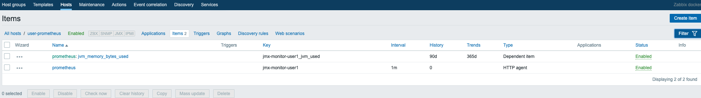

## 5. Integration Prometheus and Zabbix

### 5−1. Zabbixコンソールへログインして、新規hostを作成

- Name: user-prometheus(任意)
- Group: OpenShift(任意)
### 5-2. item1 - Metrics全体を取得するitem を作成

- Name: prometheus(任意)
- Type: [HTTP agent]
- Key: jmx-monitor-user1(任意)
- URL: http://< JMX Exporter のroute >/metrics
- Timeout: 30s -->データが多すぎるとタイムアウトするため、最初は長めにして実機で要調整
- History storage period: [Do not keep History] 

### 5−3. item2 - Metricsを抽出するitem を作成

- Name: jvm_memory_bytes_used(任意)
- Type: [Depeemdemt item]
- Key: jmx-monitor-user1_jvm_used(任意)
- Master item: [user-prometheus: prometheus] -->ホスト名: item1名  
- Type of information: [Numeric(float)] -->抽出するデータの型

このitemのprocessingで、抽出条件を定義する

- Name: [Prometheus pattern]
- Parameters: jvm_memory_bytes_userd{area="heap"} -->取得したいメトリクスを登録

item2は、Zabbixへ連携したいメトリクスを必要な分だけ定義していく。

### 5-4. Zabbix上でPrometeus Exporterから取得したデータを表示する

[トップへ戻る](Readme.md)