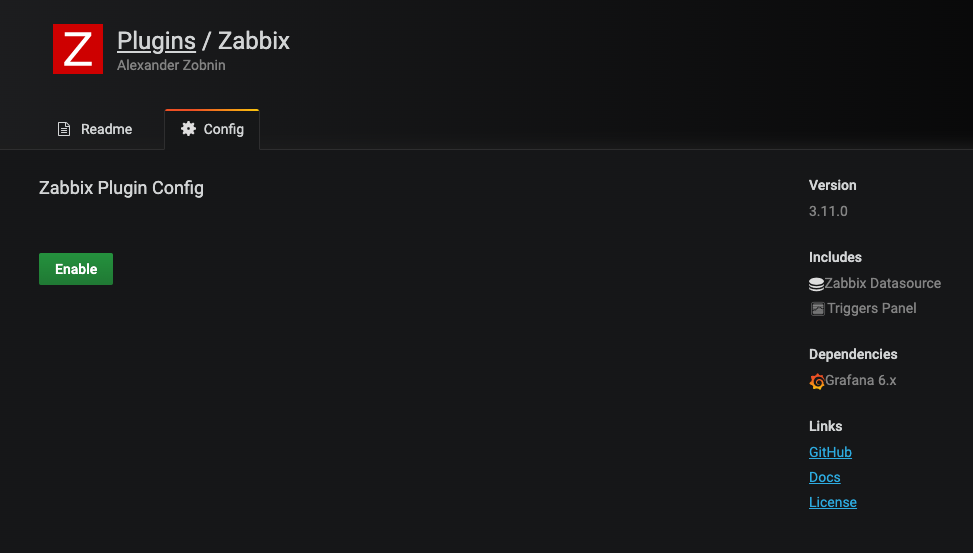
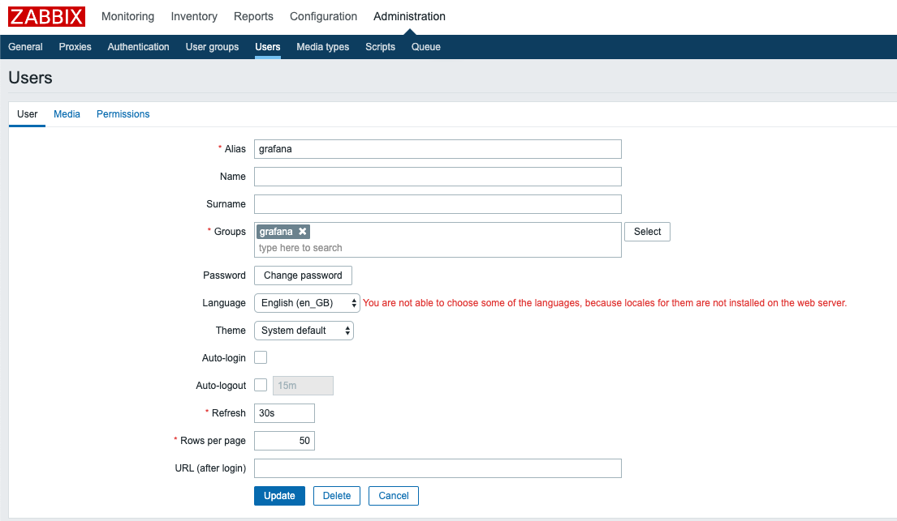
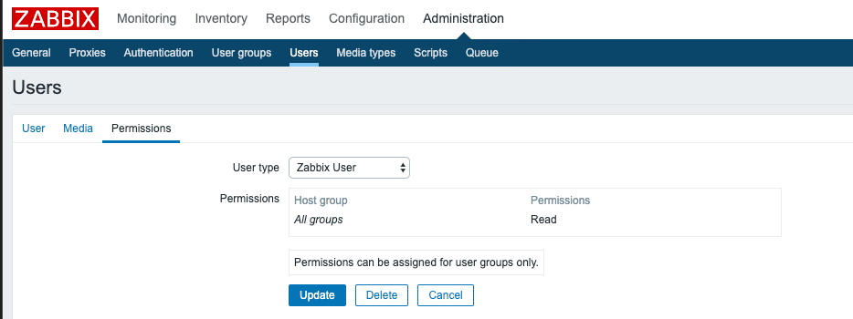
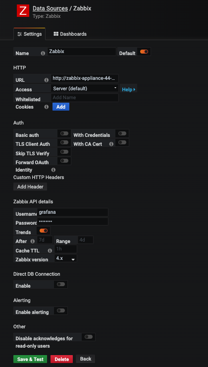
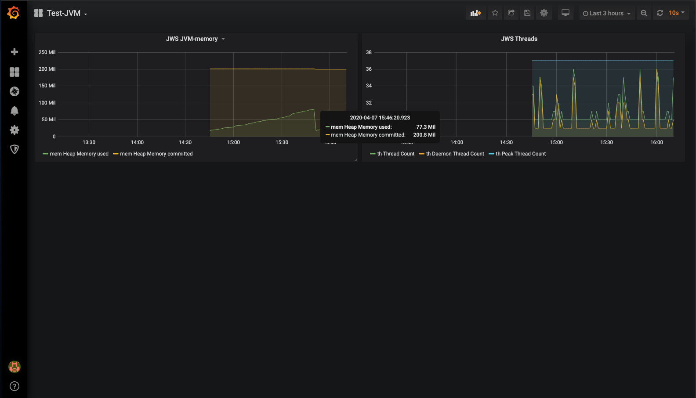

# grafana-custom

## Deploying grafana with zabbix pulgin on OpenShift
1. git clone
```sh
$ git clone https://github.com/shayashi1225/grafana-custom.git
```
2. Deploy grafana on Openshift(4.3.1)
```sh
$ cd grafana-custom/openshift
$ oc new-project grafana-custom
Already on project "grafana-custom" on server "https://api.cluster.example.com:6443".

You can add applications to this project with the 'new-app' command. For example, try:

    oc new-app django-psql-example

to build a new example application in Python. Or use kubectl to deploy a simple Kubernetes application:

    kubectl create deployment hello-node --image=gcr.io/hello-minikube-zero-install/hello-node

$ oc project
Using project "grafana-custom" on server "https://api.cluster.example.com:6443".
$  oc create imagestream grafana-custom
imagestream.image.openshift.io/grafana-custom created
$ oc apply -f buildconfig.yaml 
buildconfig.build.openshift.io/grafana-custom created
$ oc start-build grafana-custom
build.build.openshift.io/grafana-custom-1 started
$ oc get is
NAME             IMAGE REPOSITORY                                                                                                      TAGS     UPDATED
grafana-custom   default-route-openshift-image-registry.apps.cluster.example.com/grafana-custom/grafana-custom   latest   10 seconds ago
$ oc new-app grafana-custom
--> Found image a4ec5df (29 seconds old) in image stream "grafana-custom/grafana-custom" under tag "latest" for "grafana-custom"

    Grafana Custom 
    -------------- 
    Grafana custom on OpenShift

    Tags: grafana-custom

    * This image will be deployed in deployment config "grafana-custom"
    * Port 3000/tcp will be load balanced by service "grafana-custom"
      * Other containers can access this service through the hostname "grafana-custom"

--> Creating resources ...
    deploymentconfig.apps.openshift.io "grafana-custom" created
    service "grafana-custom" created
--> Success
    Application is not exposed. You can expose services to the outside world by executing one or more of the commands below:
     'oc expose svc/grafana-custom' 
    Run 'oc status' to view your app.
$ oc expose svc/grafana-custom
route.route.openshift.io/grafana-custom exposed
$ oc get route
NAME             HOST/PORT                                                                      PATH   SERVICES         PORT       TERMINATION   WILDCARD
grafana-custom   grafana-custom-grafana-custom.apps.cluster.example.com          grafana-custom   3000-tcp                 None
```
3. access URL exposed by Openshift route and login to grafana (default password admin/admin)




## Test
### Deploying zabbix(Appliance container image) on OpenShift
```sh
$ oc new-project zabbix
$ oc adm policy add-scc-to-user anyuid -z default
$ oc new-app registry.connect.redhat.com/zabbix/zabbix-appliance-44
--> Found Docker image 3b1c1c9 (5 days old) from registry.connect.redhat.com for "registry.connect.redhat.com/zabbix/zabbix-appliance-44"

    Zabbix Appliance 
    ---------------- 
    Zabbix appliance with MySQL database support and Nginx web-server

    Tags: zabbix, zabbix-appliance, mysql, nginx

    * An image stream tag will be created as "zabbix-appliance-44:latest" that will track this image
    * This image will be deployed in deployment config "zabbix-appliance-44"
    * Ports 10051/tcp, 443/tcp, 80/tcp will be load balanced by service "zabbix-appliance-44"
      * Other containers can access this service through the hostname "zabbix-appliance-44"
    * This image declares volumes and will default to use non-persistent, host-local storage.
      You can add persistent volumes later by running 'oc set volume dc/zabbix-appliance-44 --add ...'

--> Creating resources ...
    imagestream.image.openshift.io "zabbix-appliance-44" created
    deploymentconfig.apps.openshift.io "zabbix-appliance-44" created
    service "zabbix-appliance-44" created
--> Success
    Application is not exposed. You can expose services to the outside world by executing one or more of the commands below:
     'oc expose svc/zabbix-appliance-44' 
    Run 'oc status' to view your app.
$ oc expose svc/zabbix-appliance-44
route.route.openshift.io/zabbix-appliance-44 exposed
```

### Integrating grafana and zabbix
1. create user for accessing from grafana on zabbix





2. create datasource on grafana



- URL: http://zabbix-appliance-44-zabbix.apps.example.com/api_jsonrpc.php
- Zabbix API details: created user on zabbix and password

3. create dashborad using data from zabbix
