# OpenShift - Zabbix Integration Demo
主にインフラ担当者向けにOperatorの動きを見せつつ、監視として非常に多く採用されている既存のZabbixをしばらく変えずに運用したい場合を想定して、OpenShift（Prometheus）の統合をデモ

構築する構成はこちら  
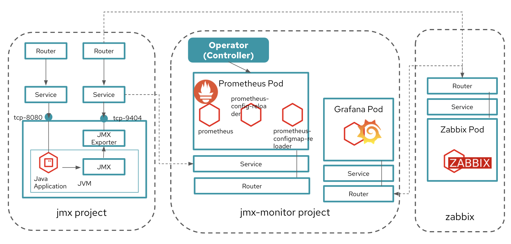

## Preparement
- OCP demo environment (ex. RHPDS - OpenShift 4.5 Workshop)

## Instructions


1. Install EAP Application   
As datasource for importing Prometheus. (Using JMX export)

2. Install Prometheus  
Install Promethus as **user** metrics datastore (Not Cluster metrics) using Operator.  

3. Install Zabbix  
Instead of external zabbix, install Zabbix on OpenShift for demonstration. Normally, integrate Prometheus on OpenShift with Zabbix already running.

4. Install Grafana and display zabbix data.  
Zabbix UI is not usefull a little bit when display graph. Grafana has very flexible UI, and so better tha display Zabbix data using Grafana.  

5. Integration Prometheus and Zabbix
Integration Promethus (Exporter) and Zabbix.


## Instructions - Details
### 1. Install EAP Application

#### 1-1. OpenShift4へのログイン  

1. OpenShift4クラスターにocコマンドでログインします。

    OpenShift APIのドメインをもとに，コマンドからOpenShiftにログインを行います。  
    ここではノードを確認することで，接続の可否を確認します。  

    ```
    $ oc login <OpenShift_API>

    Username: "<User_ID>" を入力
    Password: "<User_PW>" を入力
    ```
#### 1-2. アプリケーションビルド  
1. 監視対象アプリケーション用の「jmx-<User_ID>」という名前のプロジェクトを作ります。

    ```
    $ oc new-project jmx-<User_ID>
    $ oc project
    Using project "jmx-<User_ID>" on server "https://<OpenShift API>".
    ```

1. アプリケーションをリポジトリからCloneして，「jboss-eap-prometheus」イメージをビルドします。

    ```
    $ git clone https://github.com/openlab-red/jboss-eap-prometheus
    $ cd ./jboss-eap-prometheus/
    $ oc new-build . -n jmx-<User_ID>
    --> Found Docker image b72b49b (18 months old) from registry.access.redhat.com for "registry.access.redhat.com/jboss-eap-7/eap70-openshift:latest"
    …
    --> Success
    ```

1. ビルドの状況をocコマンドと、OpenShift4コンソールからも確認します。

    ```
    $ oc logs -f bc/jboss-eap-prometheus
    …
    Writing manifest to image destination
    Storing signatures
    Push successful
    ※イメージがPushされると動的にログから開放されるので待つ。
    (もし「Errorとなってしまった場合は」、[Ctl] + [C]で出て再度やり直す)

    $ oc get build -n jmx-<User_ID>    
    NAME                     TYPE     FROM          STATUS     STARTED          DURATION
    jboss-eap-prometheus-1   Docker   Git@23160b8   Complete   38 minutes ago   1m28s    
    
    $ oc get imagestream -n jmx-<User_ID>
    NAME                   IMAGE REPOSITORY                                                                   TAGS     UPDATED
    eap70-openshift        image-registry.openshift-image-registry.svc:5000/jmx-<User_ID>/eap70-openshift        latest   37 minutes ago
    jboss-eap-prometheus   image-registry.openshift-image-registry.svc:5000/jmx-<User_ID>/jboss-eap-prometheus   latest   36 minutes ago
    ```

#### 1-3. アプリケーションデプロイ  

1. アプリケーションの展開

    ここでは，登録した「jboss-eap-prometheus」を利用して，アプリケーションを展開します。  
    展開の際には，Java Agent用JARファイルやJMX Exporter設定ファイルのパスを環境変数(jmx-prometheus.jar=9404)で指定しておきましょう。

    ```
    $ export JBOSS_HOME=/opt/eap
    $ oc new-app -i jboss-eap-prometheus:latest \
      -n jmx-<User_ID> \
      --name=jboss-eap-prometheus \
      -e PREPEND_JAVA_OPTS="-javaagent:${JBOSS_HOME}/prometheus/jmx-prometheus.jar=9404:${JBOSS_HOME}/prometheus/config.yaml"

    上記を `\` で改行しながら1コマンドとして実行します。
    
    --> Found image 55806df (About a minute old) in image stream "jmx-<User_ID>/jboss-eap-prometheus" under tag "latest" for "jboss-eap-prometheus:latest"
    …
    --> Success
        Application is not exposed. You can expose services to the outside world by executing one or more of the commands below:
         'oc expose svc/jboss-eap-prometheus'
        Run 'oc status' to view your app.
    ```

1. 展開したアプリケーションの確認

    この時点で「jboss-eap-prometheus-1」がRunning状態になれば，デプロイ成功です。  
    JMX Exporter はデフォルトで9404ポートを公開します。

    ```
    $ oc get svc/jboss-eap-prometheus -n jmx-<User_ID>
    NAME                   TYPE        CLUSTER-IP       EXTERNAL-IP   PORT(S)                               AGE
    jboss-eap-prometheus   ClusterIP   172.30.159.173   <none>        8080/TCP,8443/TCP,8778/TCP,9404/TCP   30s

    $ oc get dc/jboss-eap-prometheus -n jmx-<User_ID>
    NAME                   REVISION   DESIRED   CURRENT   TRIGGERED BY
    jboss-eap-prometheus   1          1         1         config,image(jboss-eap-prometheus:latest)

    $ oc get pod -n jmx-<User_ID>
    NAME                           READY   STATUS      RESTARTS   AGE
    jboss-eap-prometheus-1-2z9zs   1/1     Running     0          4m50s
    jboss-eap-prometheus-1-deploy  0/1     Completed   0          4m59s
    jboss-eap-prometheus-1-build   0/1     Completed   0          9m19s
    ```

    「jboss-eap-prometheus-1-2z9zs」(2z9zsはデプロイしたときにランダムに生成される)がRunning状態になるまで待ちましょう。

#### 1-4. アプリケーションのアノテーション設定

JMX ExporterのServiceに対して、アノテーションをつけておく。   

```
$ oc annotate svc jboss-eap-prometheus prometheus.io/scrape='true' -n jmx-<User_ID>
service/jboss-eap-prometheus annotated

$ oc annotate svc jboss-eap-prometheus prometheus.io/port='9404' -n jmx-<User_ID>
service/jboss-eap-prometheus annotated
```

#### 1-5. アプリケーションのルータ設定 

「jboss-eap-prometheus」のアプリケーション(tcp-8080)ポートを、ルータに接続。

```
$ oc expose svc/jboss-eap-prometheus --name=tcp-8080 --port=8080 -n jmx-<User_ID>
route.route.openshift.io/tcp-8080 exposed

$ oc get route tcp-8080 -n jmx-<User_ID>
NAME       HOST/PORT                                PATH   SERVICES               PORT   TERMINATION   WILDCARD
tcp-8080   tcp-8080-jmx.XXX.openshiftworkshop.com          jboss-eap-prometheus   8080                 None
```

Host/Port (http://tcp-8080-jmx.XXXX.openshiftworkshop.com) をブラウザ上からアクセスすると、アプリケーションコンテンツが確認できる。   
    


次に「jboss-eap-prometheus」のPromtheus Exporter(tcp-9404)ポートを、ルータに接続。

```
$ oc expose svc/jboss-eap-prometheus --name=tcp-9404 --port=9404 -n jmx-<User_ID>
route.route.openshift.io/tcp-9404 exposed

$ oc get route tcp-9404 -n jmx-<User_ID>
NAME       HOST/PORT                                PATH   SERVICES               PORT   TERMINATION   WILDCARD
tcp-9404   tcp-9404-jmx.XXX.openshiftworkshop.com          jboss-eap-prometheus   9404                 None
```

Host/Port (tcp-9404-jmx.XXXX.openshiftworkshop.com) をブラウザ上からアクセスすると、JMX Exporterから取得したPromSQLのクエリが確認できる。   
    
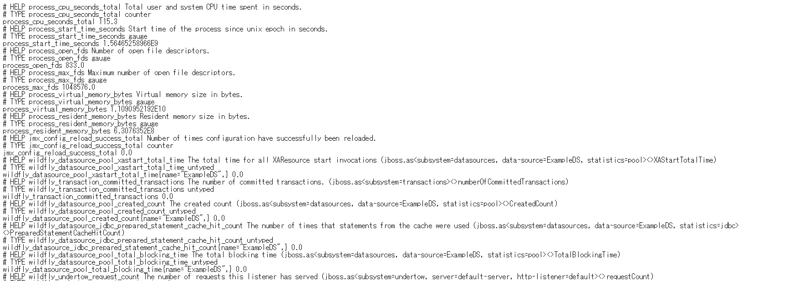

> 今回のDemoでは、このデータへZabbixからアクセスする

### 2. Prometheus Operatorの展開
#### 2-1. プロジェクト作成  
Prometheus Operator用のプロジェクトを作成する。

```
$ oc new-project jmx-monitor-<User_ID>
$ oc project
Using project "jmx-monitor-<User_ID>" on server "https://<OpenShift API>".
```

#### 2-2. Subscriptionを作成  
ブラウザからOpenShift Portalにログインし、[Operators]>[OperatorHub]からPrometheusを検索する。   
この際、プロジェクトが「jmx-monitor-<User_ID>」であることを確認しておく。   
          
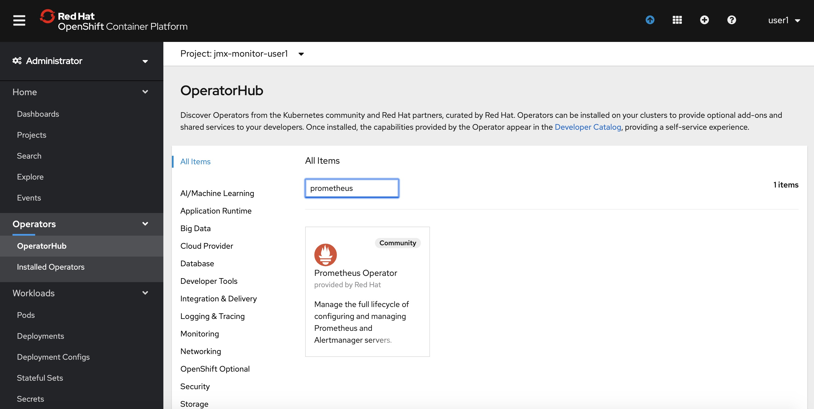

OperatorHubの中から、Prometheus Operator(Community)を選択して、[Install]を行う。        
※コミュニティ版を利用すると、警告が表示されるので、一旦[Continue]で続ける。(OCP 4.4現在)    
     
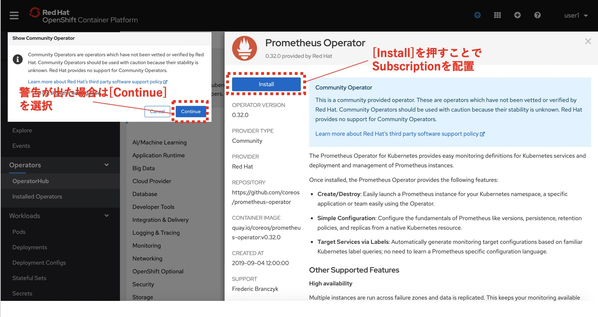

Subscriptionは、以下の設定で作成する。  
* Installation Mode  
A specific namespace on the cluster: [PR] jmx-monitor-<User_ID>  
* Update Channel  
beta  
* Approval Strategy  
Automatic   
  
|InstallMode|Action|
|:--|:--|
|OwnNamespace|Operatorは、独自のnamespace を選択するOperatorGroupのメンバーにできます。|
|SingleNamespace|Operatorは1つのnamespace を選択するOperatorGroupのメンバーにできます。|
|MultiNamespace|Operatorは複数の namespace を選択するOperatorGroupのメンバーにできます。|
|AllNamespaces|Operatorはすべての namespace を選択するOperatorGroupのメンバーできます (ターゲット namespace 設定は空の文字列 "" です)。|

実際にGUI上では以下のように設定し、[Subscribe]を選択します。
   
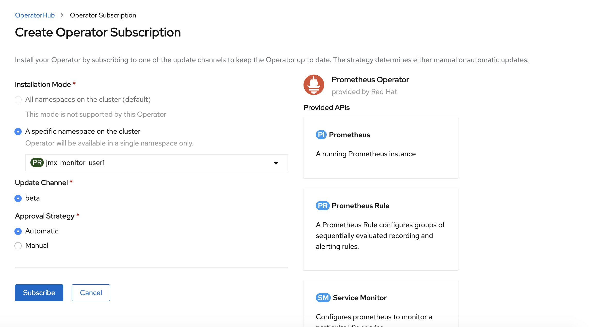

正しくSubscriptionが設定されると、[Status]がSucceededになりOperatorが展開されます。また、以下のように[Operators]>[Installed Operators]>[Prometheus Operator]>[Subscription]から、Subscriptionの概要が確認できます。

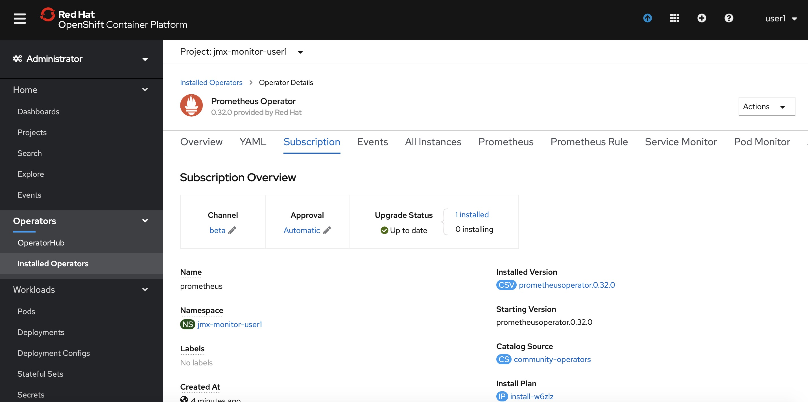

これで、Prometheus OperatorのSubscriptionが作成されました。なおこの時点では、CRDの登録やPrometheus Operatorの配置が行われるだけで、Prometheusのプロセス自体は構築されません。

#### 2-3. CRD/Operatorの確認    

Prometheus OperatorのSubscriptionを作成すると、CRD(Custom Resource Definition)が作成される。

```
$ oc get crd -n jmx-monitor-<User_ID> |grep monitoring.coreos.com
alertmanagers.monitoring.coreos.com                         2020-04-27T01:14:40Z
podmonitors.monitoring.coreos.com                           2020-04-27T01:14:41Z
prometheuses.monitoring.coreos.com                          2020-04-27T01:14:40Z
prometheusrules.monitoring.coreos.com                       2020-04-27T01:14:41Z
servicemonitors.monitoring.coreos.com                       2020-04-27T01:14:40Z
```


Promethus Operatorは、標準で4つ（最新バージョンでは5つ）のCRDを保持している。  
GUIからは[Operators]>[Installed Operators]>[Prometheus Operator] を確認。オペレーターカタログとして、デプロイされたPromethus OperatorのCRDが確認できる。

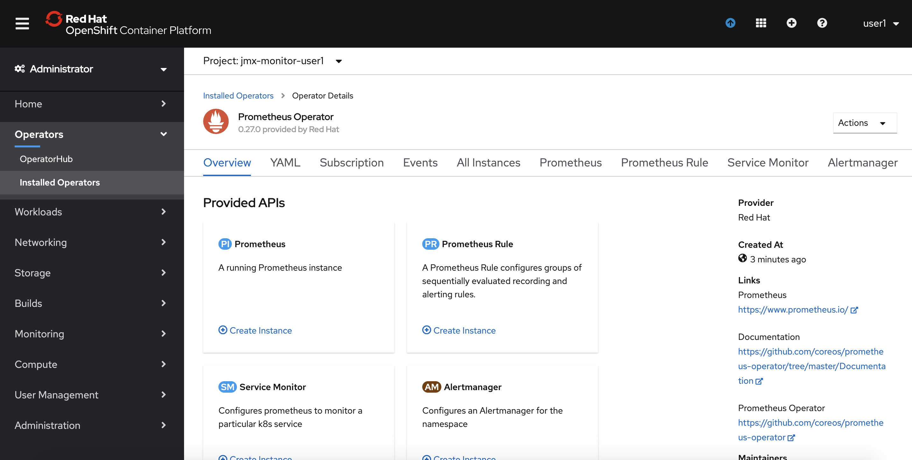

また、Prometheus OperatorがOLMによって配置される。

```
$ oc get po -n jmx-monitor-<User_ID>
NAME                                   READY   STATUS    RESTARTS   AGE
prometheus-operator-7cf7d5f74b-r4qmd   1/1     Running   0          16m
```


### 3. Install Zabbix  
### 4. Install Grafana and display zabbix data.  
[こちらの手順を参照](README.md)

> Namespace名は、適宜読み替え


### 5. Integration Prometheus and Zabbix

#### 5−1. Zabbixコンソールへログインして、新規hostを作成
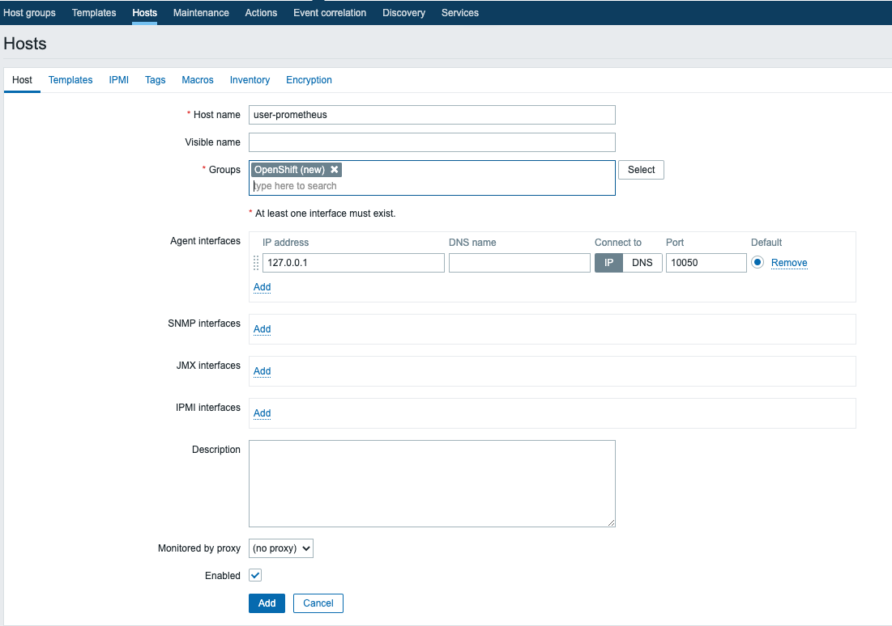
- Name: user-prometheus(任意)
- Group: OpenShift(任意)
#### 5-2. item1 - Metrics全体を取得するitem を作成
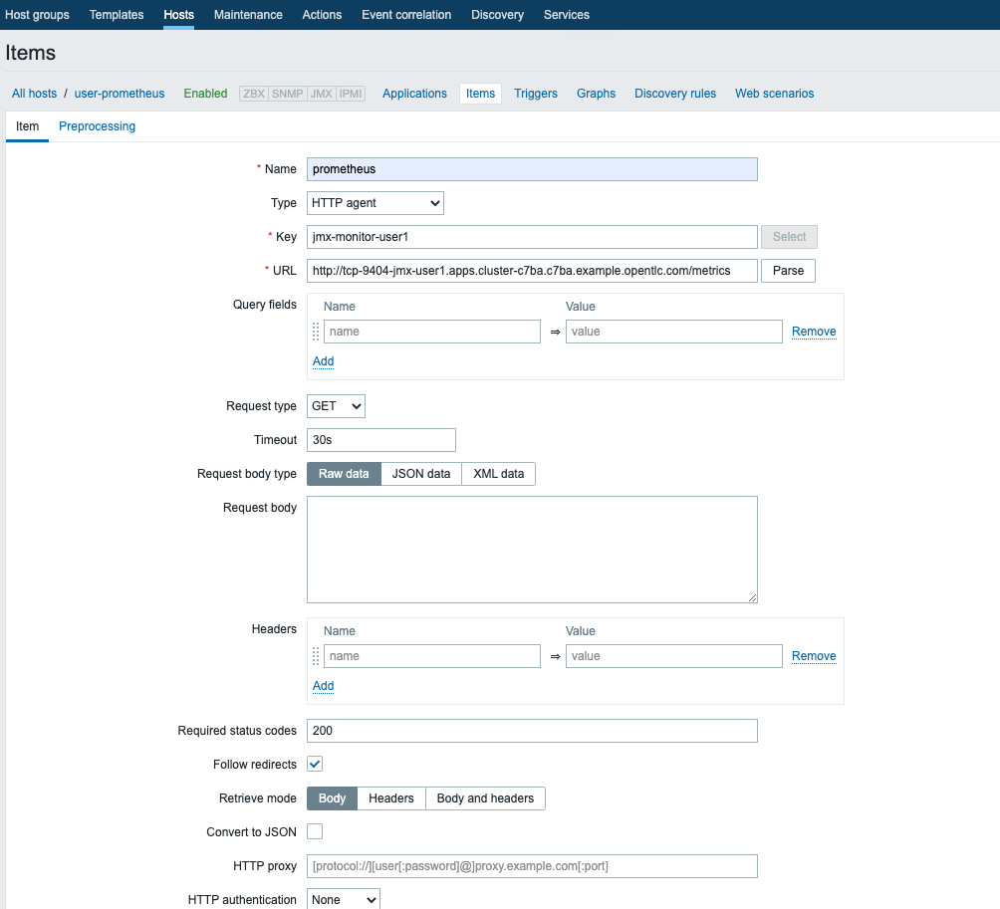
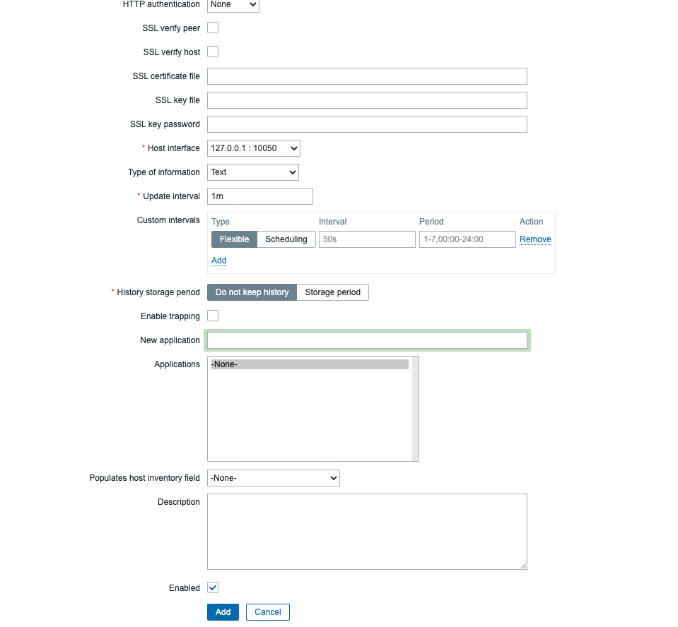

- Name: prometheus(任意)
- Type: [HTTP agent]
- Key: jmx-monitor-user1(任意)
- URL: http://< JMX Exporter のroute >/metrics
- Timeout: 30s -->データが多すぎるとタイムアウトするため、最初は長めにして実機で要調整
- History storage period: [Do not keep History] 

#### 5−3. item2 - Metricsを抽出するitem を作成
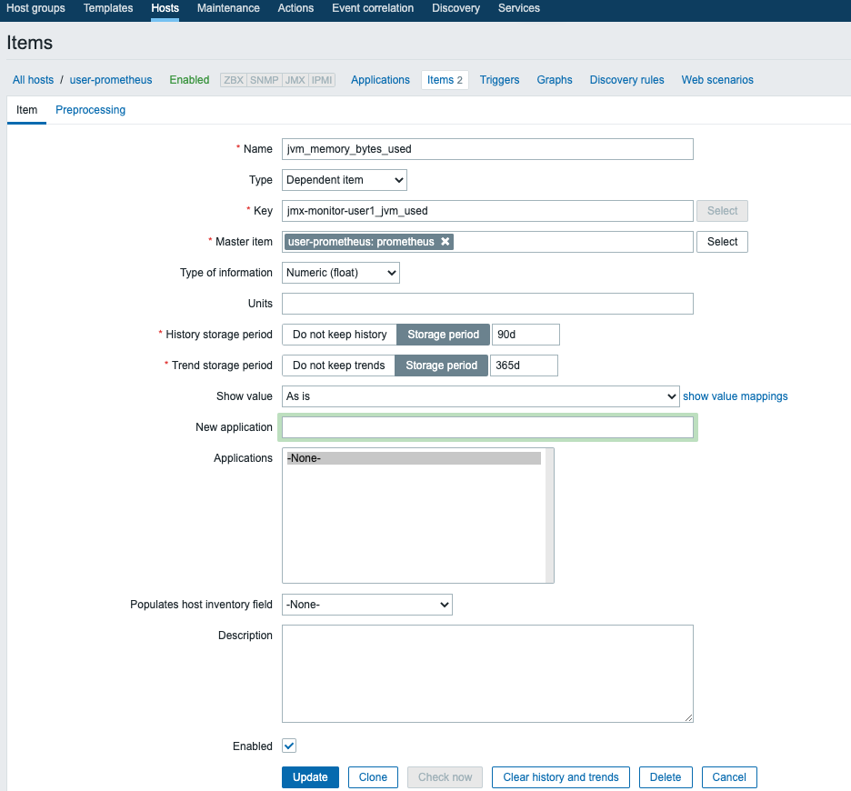

- Name: jvm_memory_bytes_used(任意)
- Type: [Depeemdemt item]
- Key: jmx-monitor-user1_jvm_used(任意)
- Master item: [user-prometheus: prometheus] -->ホスト名: item1名  
- Type of information: [Numeric(float)] -->抽出するデータの型


このitemのprocessingで、抽出条件を定義する
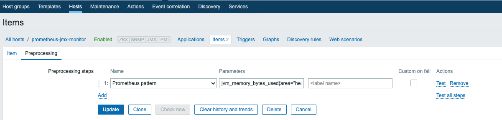
- Name: [Prometheus pattern]
- Parameters: jvm_memory_bytes_userd{area="heap"} -->取得したいメトリクスを登録

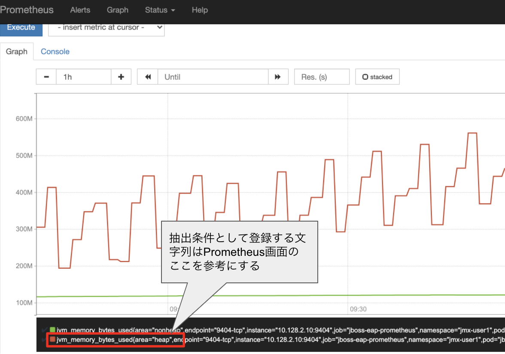

item2は、Zabbixへ連携したいメトリクスを必要な分だけ定義していく。
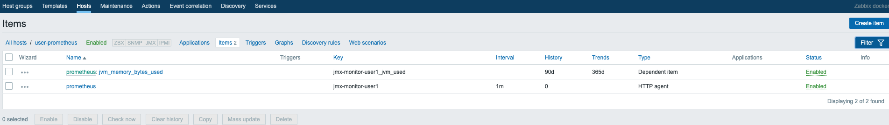

#### 5-4. Zabbix上でPrometeusから取得したデータを表示する
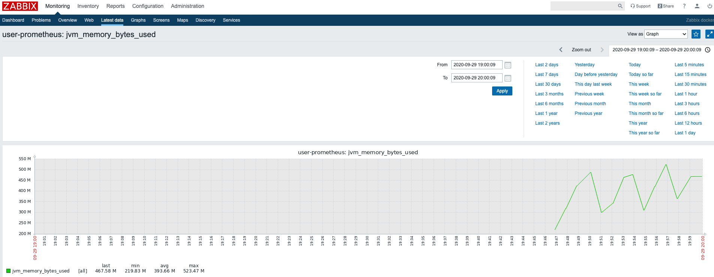

### おまけ
Grafanaでの参照
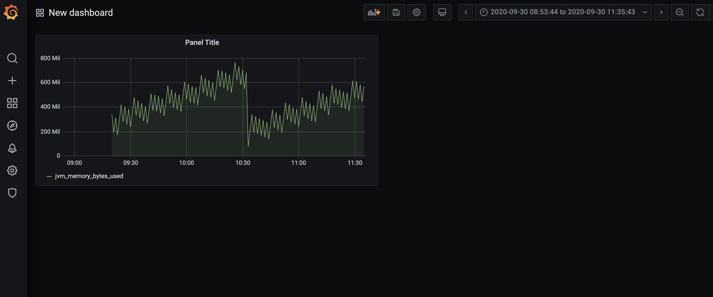
